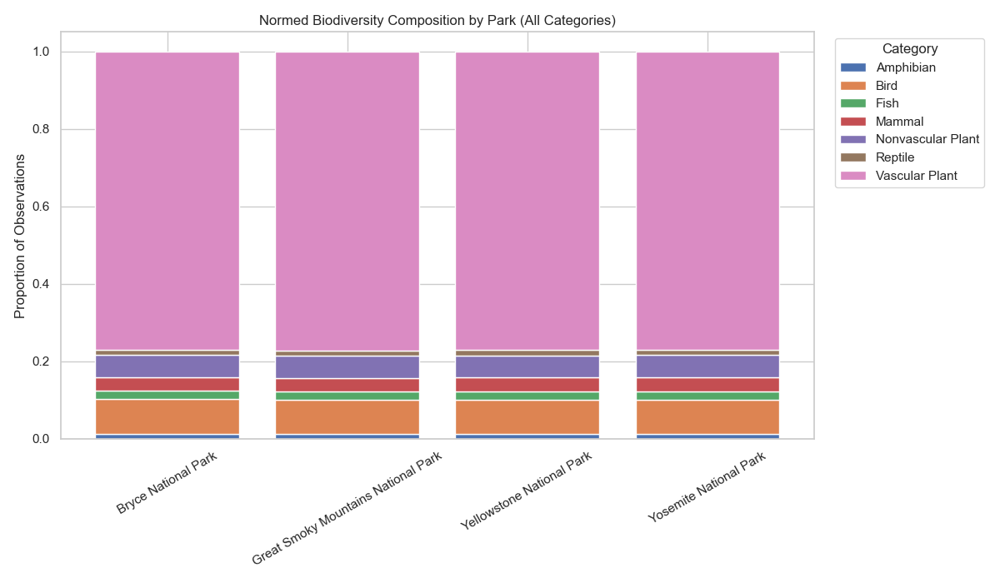

# Biodiversity in U.S. National Parks

This project analyzes biodiversity observation data across four U.S. national parks, with a focus on **conservation status patterns** and **methodological consistency** in reported observations.

The analysis emphasizes **validation before comparison**, careful aggregation, and clearly bounded interpretation.

---

## Key Results

* After normalization, **major taxonomic composition is highly consistent across parks**, supporting cross-site comparison at this aggregation level.
* Species classified as **No Concern dominate the dataset**, with conservation-labeled observations comprising a small fraction overall.
* **Observation-weighted and species-weighted conservation proportions are closely aligned**, suggesting results are not driven solely by a handful of highly observed taxa.
* Species-level views highlight **low-observation taxa under conservation labels**, interpreted cautiously as observation patterns rather than abundance or risk.

> Observation counts reflect reporting frequency, not population size or ecological health.

---

## Example Output

**Normalized biodiversity composition by park:**

---

## Repository Guide

* **`REPORT.md`** — Full methods, validation steps, figures, and interpretive boundaries
* **Notebooks (`*.ipynb`)** — Stepwise analysis from data ingestion to species-level exploration
* **`environment.yml`** — Conda environment specification
* **`fig*.png`** — Exported figures used in the report

---

## Full Report

For a complete description of methods, validation logic, and detailed findings, see:

➡️ **[Full Report](biodiversity_starter/REPORT.md)**

---
