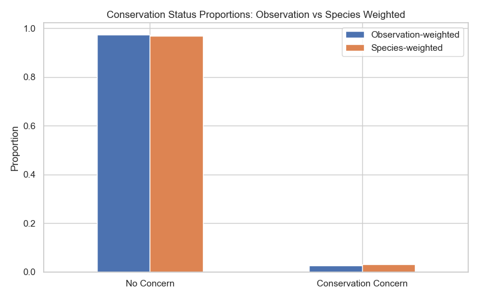
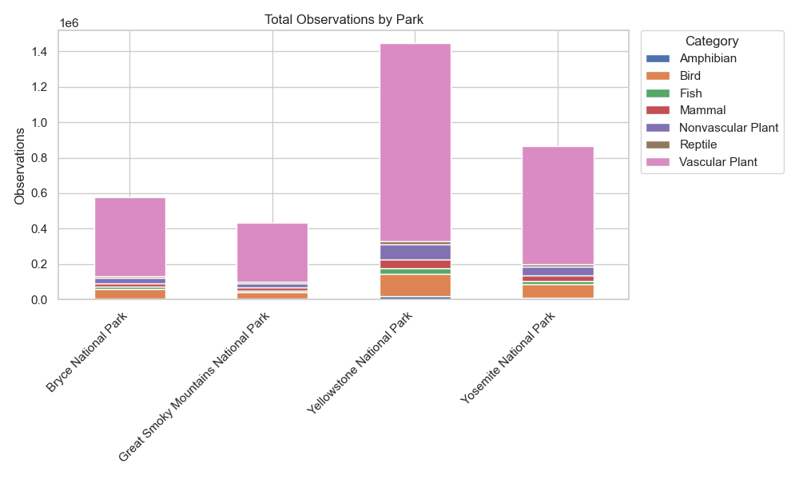
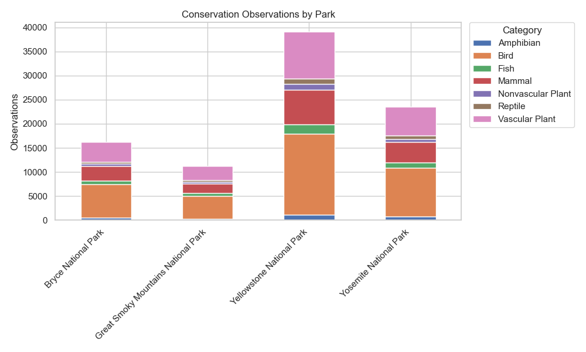
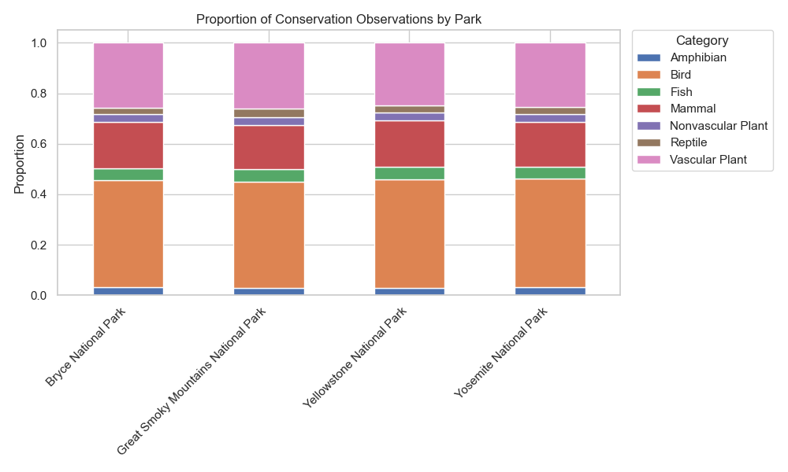
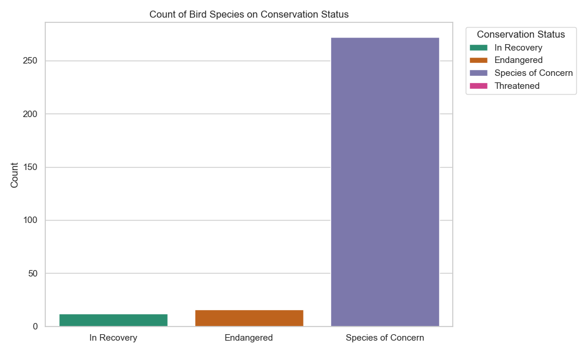
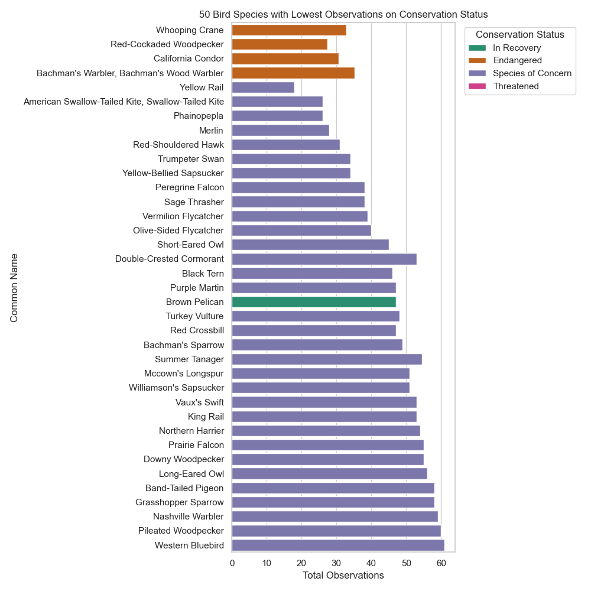
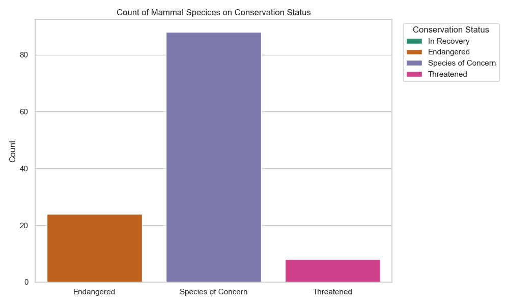
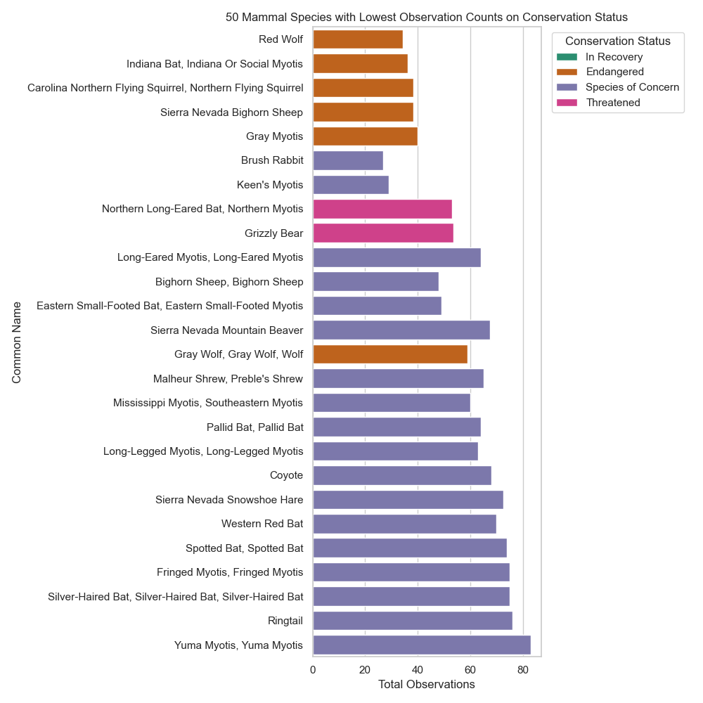

# Biodiversity in U.S. National Parks

**Methods, Validation, and Key Findings**

This project analyzes biodiversity observation data from four U.S. national parks, with a focus on **conservation status patterns**.
The analysis emphasizes **methodological validation**, **descriptive clarity**, and **careful interpretive boundaries**.

---

## Results at a Glance

* **Observation structure is highly consistent across parks** at the level of major taxonomic categories after normalization.
* The dataset is dominated by species classified as **No Concern**, with conservation-labeled observations comprising a small fraction overall.
* **Observation-weighted and species-weighted conservation proportions are closely aligned**, suggesting results are not driven solely by a small number of highly observed taxa.
* Across parks, **normalized conservation-status composition is broadly similar**, supporting cross-park comparisons at this aggregation level.
* Species-specific views identify **low-observation taxa under conservation labels**, but these are interpreted cautiously as classification frequency, not abundance or risk.

> **Important:** Observation counts reflect recorded observations, not population size or ecological health.

---

## Project Overview

**Goal:** Examine biodiversity observations across national parks and assess conservation-status structure while validating comparability across sites.

### Data Sources

* `observations.csv` — species observations by park
* `species_info.csv` — species metadata (category, conservation status)

### Outputs

* Clean merged dataset: `df_merged.feather`
* Figures: `fig*.png`

---

## Notebook 1 — Load, Validate, Transform

**Notebook:** `1_insp_validate_transform.ipynb`

### Purpose

Create a clean, analysis-ready dataset and ensure merge integrity.

### Key Steps

* Aggregate observations by `scientific_name` and `park_name`
* Resolve duplicate conservation statuses using priority rules
* Merge species metadata into observations
* Convert key columns to categorical types
* Verify observation totals remain unchanged
* Export final dataset to `df_merged.feather`

**Outcome:** A single, validated dataframe used consistently throughout the project.

---

## Notebook 2 — Validation: Internal Consistency Across Parks

**Notebook:** `2_eda_validation.ipynb`

### Question

Can we reasonably trust cross-park comparisons at the chosen level of aggregation?

### Method

* Aggregate observations by park and major taxonomic category
* Normalize within parks to remove scale effects
* Compare proportional composition across sites

### Key Figure


### Validation Finding (bounded)

Normalized category composition is **nearly identical across parks**, suggesting methodological consistency at this level of aggregation.
This does **not** establish ecological equivalence or rule out species-level detection bias.

---

## Notebook 4 — Describe Conservation Status Across Observations

**Notebook:** `4_eda_conservation_status_overall.ipynb`

### Question

What is the overall distribution of conservation status classifications?

### Method

* Aggregate by conservation status
* Compare:

  * Observation-weighted proportions
  * Species-weighted proportions

### Key Figure



### Finding (descriptive)

Both weighting approaches produce similar proportions, indicating that conservation patterns are not dominated by a small set of highly observed species.

---

## Notebook 5 — Compare Conservation Structure by Park

**Notebook:** `5_compare_conservation_status_by_park.ipynb`

### Method

* Examine total observations by park
* Subset to conservation-labeled observations
* Compare normalized conservation composition across parks

### Key Figures





### Finding (bounded)

Conservation-labeled observations exhibit similar proportional structure across parks, supporting comparative analysis at this resolution.

---

## Notebook 6 — Species-Specific Exploration

**Notebook:** `6_species_specific.ipynb`

### Method

For each major category:

* Filter to conservation-labeled observations
* Plot:

  1. Counts by conservation status
  2. Lowest-observation species under conservation labels

### Key Figures (Selected)

**Birds**



**Mammals**



*(Additional figures included for fish, amphibians, reptiles, vascular and nonvascular plants.)*

### Interpretation (bounded)

Species-specific plots highlight under-observed taxa under conservation labels, but these results are interpreted as **observation patterns**, not abundance or ecological risk.

---

## Interpretive Boundaries

* Observation counts reflect **reporting frequency**, not population size
* Results may be influenced by:

  * observation effort
  * accessibility
  * detectability
* Findings emphasize **structure and consistency**, not causal inference

---

## Repository Structure

```
├── README.md
├── 1_insp_validate_transform.ipynb
├── 2_eda_validation.ipynb
├── 4_eda_conservation_status_overall.ipynb
├── 5_compare_conservation_status_by_park.ipynb
├── 6_species_specific.ipynb
├── df_merged.feather
├── observations.csv
├── species_info.csv
└── fig*.png
```

---

## Environment

All analyses were executed in a Python 3 environment with the following core dependencies:

```text
Python            3.11.x
pandas            ≥ 2.0
numpy             ≥ 1.24
matplotlib        ≥ 3.7
seaborn           ≥ 0.13
```

Figures were generated using Matplotlib and Seaborn.
All data transformations and analyses were performed using pandas and NumPy.

The project was run locally in a JupyterLab environment. Results should be reproducible in any standard Python environment meeting the above requirements.

To reproduce the analysis:

```bash
conda env create -f environment.yml
conda activate ds311
```

---

## Reproducibility

Run notebooks in numeric order using the provided datasets.
All figures embedded above are generated directly from the notebooks in this repository.
